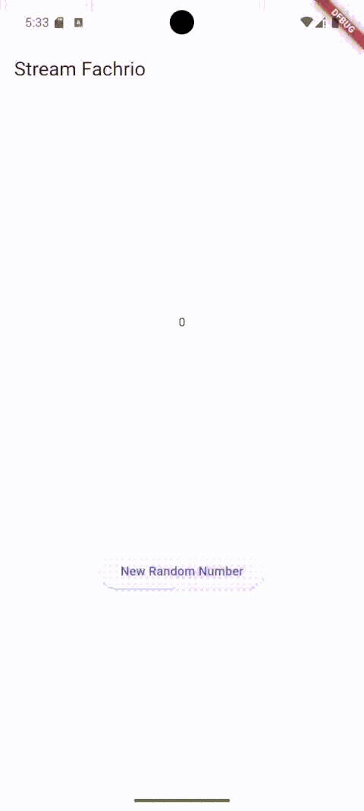

# stream_fachrio

A new Flutter project.

## Getting Started

This project is a starting point for a Flutter application.

A few resources to get you started if this is your first Flutter project:

- [Lab: Write your first Flutter app](https://docs.flutter.dev/get-started/codelab)
- [Cookbook: Useful Flutter samples](https://docs.flutter.dev/cookbook)

For help getting started with Flutter development, view the
[online documentation](https://docs.flutter.dev/), which offers tutorials,
samples, guidance on mobile development, and a full API reference.

## Penjelasan Kode pada lib/stream.dart (P1: Jawaban Soal 3)

### Fungsi keyword `yield*`

Pada kode:

```dart
Stream<Color> getColors() async* {
  yield* Stream.periodic(const Duration(seconds: 1), (int i) {
    int index = i % _colors.length;
    return _colors[index];
  });
}
```

Keyword `yield*` digunakan untuk meneruskan (menyebarkan) seluruh nilai yang dihasilkan oleh stream lain ke dalam stream yang sedang dibuat. Dalam hal ini, `yield*` akan mengeluarkan setiap nilai yang dihasilkan oleh `Stream.periodic` secara langsung ke pendengar (listener) dari stream `getColors()`.

### Maksud isi perintah kode

Kode tersebut membuat sebuah stream yang setiap 1 detik akan mengeluarkan (emit) satu warna dari daftar `_colors`. Warna yang dikeluarkan akan berurutan sesuai urutan pada list, dan akan mengulang dari awal jika sudah sampai di akhir list (menggunakan operasi modulus). Dengan demikian, stream ini dapat digunakan untuk menampilkan warna yang berubah-ubah setiap detik secara otomatis.

## Hasil Praktikum (P1: Jawaban Soal 4)


## Perbedaan Menggunakan `listen` dan `await for` pada Stream (P1: Jawaban Soal 5)

Pada kode di `main.dart`, digunakan:

```dart
void changeColor() async {
  await for (var eventColor in colorStream.getColors()) {
    setState(() {
      bgColor = eventColor;
    });
  }
}
```

### Penjelasan:

- **`await for`** digunakan di dalam fungsi async untuk menerima data dari stream satu per satu secara sinkron (menunggu setiap data datang sebelum melanjutkan ke data berikutnya). Cocok digunakan jika ingin memproses setiap data secara berurutan dan menunggu proses selesai sebelum melanjutkan.
- **`listen`** adalah metode pada stream yang menerima callback (fungsi) yang akan dipanggil setiap kali ada data baru. Dengan `listen`, kita tidak perlu menunggu data berikutnya, sehingga lebih cocok untuk kasus di mana kita ingin merespons setiap data secara reaktif tanpa menunggu proses sebelumnya selesai.

### Perbedaan Utama:

- `await for` hanya bisa digunakan di dalam fungsi async dan akan menunggu setiap data stream secara berurutan.
- `listen` bisa digunakan di mana saja dan memberikan lebih banyak kontrol, seperti pause, resume, dan cancel subscription.
- Dengan `await for`, eksekusi fungsi akan "tertahan" di loop sampai stream selesai, sedangkan dengan `listen`, eksekusi fungsi tetap berjalan dan callback akan dipanggil setiap ada data baru.

### Contoh Penggunaan `listen`:

```dart
colorStream.getColors().listen((eventColor) {
  setState(() {
    bgColor = eventColor;
  });
});
```

## Penjelasan Maksud Kode pada `listen` dan `addRandomNumber` di main.dart (P2: Jawaban Soal 6)

### Kode listen pada stream:

```dart
numberStream = NumberStream();
numberStreamController = numberStream.controller;
Stream stream = numberStreamController.stream;
stream.listen((event) {
  setState(() {
    lastNumber = event;
  });
});
```

**Penjelasan:**

- Membuat objek `NumberStream` dan mengambil `controller`-nya.
- Mengambil stream dari controller.
- Menggunakan `listen` untuk mendengarkan setiap data (event) baru yang masuk ke stream.
- Setiap kali ada data baru, fungsi callback di dalam `listen` akan dijalankan, yang akan memanggil `setState` untuk memperbarui nilai `lastNumber` di UI dengan data terbaru dari stream.

### Kode addRandomNumber:

```dart
void addRandomNumber() {
  Random random = Random();
  int myNum = random.nextInt(10);
  numberStream.addNumberToSink(myNum);
}
```

**Penjelasan:**

- Membuat objek `Random` untuk menghasilkan angka acak.
- Mengambil angka acak antara 0 sampai 9.
- Mengirimkan angka acak tersebut ke stream melalui fungsi `addNumberToSink` milik objek `NumberStream`.
- Angka ini kemudian akan diterima oleh listener stream (kode sebelumnya), sehingga nilai `lastNumber` di UI akan diperbarui secara otomatis.


## Penjelasan Maksud Kode Error Handling pada Stream (P2: Jawaban Soal 7)

### Kode addError di stream.dart:

```dart
addError() {
  controller.sink.addError('Error');
}
```

**Penjelasan:**

- Fungsi ini digunakan untuk menambahkan error ke dalam stream. Ketika fungsi ini dipanggil, stream akan mengirimkan event error dengan pesan 'Error' ke semua listener-nya.

### Kode onError pada listen di main.dart:

```dart
stream.listen((event) {
  setState(() {
    lastNumber = event;
  });
}).onError((error) {
  setState(() {
    lastNumber = -1;
  });
});
```

**Penjelasan:**

- Ketika stream menerima event error, blok `onError` akan dijalankan.
- Pada kasus ini, jika terjadi error pada stream, maka nilai `lastNumber` akan di-set menjadi -1, sehingga UI dapat menampilkan bahwa terjadi error.

### Kode addRandomNumber yang memanggil addError:

```dart
void addRandomNumber() {
  Random random = Random();
  // int myNum = random.nextInt(10);
  // numberStream.addNumberToSink(myNum);
  numberStream.addError();
}
```

**Penjelasan:**

- Pada kode ini, fungsi `addRandomNumber` tidak lagi mengirimkan angka acak ke stream, melainkan memanggil fungsi `addError`.
- Artinya, setiap kali tombol ditekan, stream akan mengirimkan error, sehingga blok `onError` pada listener akan dijalankan dan nilai `lastNumber` di UI akan berubah menjadi -1.

## Penjelasan Maksud Kode StreamTransformer dan Transformasi Stream di main.dart (P3: Jawaban Soal 8)

### Deklarasi transformer:

```dart
late StreamTransformer transformer;
```

**Penjelasan:**

- Mendeklarasikan variabel bertipe `StreamTransformer` yang akan digunakan untuk mentransformasi data pada stream.

### Inisialisasi transformer:

```dart
transformer = StreamTransformer<int, int>.fromHandlers(
  handleData: (value, sink) {
    sink.add(value * 10);
  },
  handleError: (error, trace, sink) {
    sink.add(-1);
  },
  handleDone: (sink) => sink.close(),
);
```

**Penjelasan:**

- Membuat objek `StreamTransformer` yang akan mengubah setiap data bertipe `int` yang masuk ke stream.
- Pada `handleData`, setiap data yang masuk akan dikalikan 10 sebelum diteruskan ke stream berikutnya.
- Pada `handleError`, jika terjadi error, maka nilai -1 akan dikirim ke stream.
- Pada `handleDone`, stream akan ditutup jika sudah selesai.

### Penggunaan transformasi pada stream:

```dart
stream
    .transform(transformer)
    .listen((event) {
      setState(() {
        lastNumber = event;
      });
    })
    .onError((error) {
      setState(() {
        lastNumber = -1;
      });
    });
```

**Penjelasan:**

- Stream dari `numberStreamController` akan diproses terlebih dahulu oleh `transformer` sebelum didengarkan oleh listener.
- Setiap data yang masuk akan dikalikan 10, lalu hasilnya akan diterima oleh listener dan digunakan untuk memperbarui nilai `lastNumber` di UI.
- Jika terjadi error, maka nilai -1 akan dikirim dan UI juga akan diperbarui menjadi -1.


